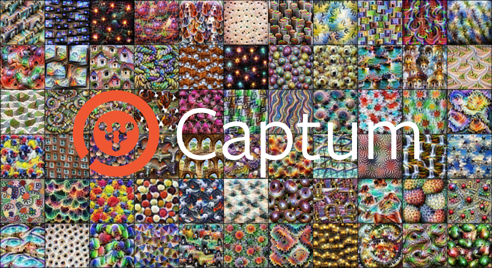

Overview
=================

1. [About](#about)
2. [Structure](#structure)
    1. [Image Optimization](#image-optimization)
3. [Parameterizations](#parameterizations)
    1. [FFTImage](#fftimage)
4. [Modules](#modules)
    1. [Rendering Modules](#rendering-modules)
    2. [Submodules](#submodules)
5. [Getting Started](#getting-started)
    1. [Basic](#basic)
    2. [Circuits](#circuits)
6. [Docs](#docs)
7. [Tutorials](#tutorials)
8. [References](#references)


About
-----------------

The Optim module is a set of tools for optimization based interpretability for neural networks. It is a continuation of the research work performed by the team behind the [tensorflow/lucid](https://github.com/tensorflow/lucid) library.

The Optim module is designed to be extremely customizable, as to avoid limitations in its research potential.

The initial concept for the Optim module was devised by Ludwig Shubert, and then developed by Ben Egan and Swee Kiat Lim with help from Chris Olah & Narine Kokhlikyan.


Structure
-----------------

### Image Optimization


The standard image rendering process works like this for the forward pass, with loss objectives being able to target any of the steps:

* ``NaturalImage`` (``ImageParameterization`` ➔ ``ToRGB`` ➔ Squash Function ➔ ``ImageTensor``) ➔ Transforms ➔ Model


Parameterizations
-----------------

Parameterizations (also known as differentiable image parameterizations), are used to precondition optimizers.


### FFTImage

The default settings store image parameters in a fully decorrelated format where the spatial information and channel information is decorrelated. By preconditioning our optimizer with decorrelated data, we alter the loss landscape to make optimization significantly easier and decrease the presence of high frequency patterns.


* Decorrelated Data ➔ Recorrelate Spatial ➔ Recorrelate Color ➔ Squash Function ➔ Transforms ➔ Model

By default, recorrelation occurs entirely within the ``NaturalImage`` class.


Modules
-----------------

### Rendering Modules

* **Images**: A PyTorch tensor subclass for image tensors, and mutiple image parameterizations.

* **Transforms**: The transforms module contains various transforms that are useful for performing transform robustness when rendering.

* **Loss**: The loss module contains numerous loss objectives that are all fully composable with mathematical ops.

* **Optimization**: The optimization module contains the optimization class and a stop criteria function.


### Submodules

* **Reducer**: The reducer module makes it easy to perform dimensionality reduction with a wide array of algorithms like [t-SNE](https://scikit-learn.org/stable/modules/generated/sklearn.manifold.TSNE.html), [UMAP](https://umap-learn.readthedocs.io/en/latest/), [PCA](https://scikit-learn.org/stable/modules/generated/sklearn.decomposition.PCA.html), & [NMF](https://scikit-learn.org/stable/modules/generated/sklearn.decomposition.NMF.html).

* **Circuits**: The circuits module allows for the extraction of meaningful weight interactions from between neurons which aren’t literally adjacent in a neural network.

* **Models**: The models module contains the model zoo of pretrained models along with various help functions and classes.

* **Dataset**: The dataset module provides functions for calculating color correlation matrices of image datasets.


Getting Started
-----------------

### **Basic**

Below we demonstrate the usage of the Optim library for rendering a simple channel loss objective.

```
import torch
import captum.optim as opt

device = torch.device("cuda:0" if torch.cuda.is_available() else "cpu")
```

We load the pre-trained InceptionV1 model instance, using Optim's ``RedirectedReLU`` instead ``nn.ReLU``.

```
model = opt.models.googlenet(pretrained=True).to(device)
```

Next we define our optimization objective using Optim's ``ChannelActivation``.

```
loss_fn = opt.loss.ChannelActivation(model.mixed4a, 465)
```

We also define a decorrelated image parameterization & a set of transforms.

```
image = opt.images.NaturalImage((224, 224)).to(device)
transforms = opt.transforms.TransformationRobustness()
```

We can now render the visualization using a simple helper function.

```
def visualize(model, loss_fn, image, transforms):
    obj = opt.InputOptimization(model, loss_fn, image, transforms)
    history = obj.optimize()
    image().show()

visualize(model, loss_fn, image, transforms)
```


### **Circuits**

Below we demonstate how to use the circuits submodule to obtain important contextual information for the neurons in a neural network.

We start off by loading a linear version of the InceptionV1 model, where ``nn.MaxPool2d`` operations have been replaced with their ``nn.AvgPool2d`` equivalents. The nonlinear ``nn.ReLU`` layers have also been replaced Optim's equivalent of the linear ``nn.Identity`` layer.

```
import torch
import captum.optim as opt

device = torch.device("cuda:0" if torch.cuda.is_available() else "cpu")

# Load InceptionV1 model with nonlinear layers replaced by their linear equivalents
linear_model = (
    opt.models.googlenet(pretrained=True, use_linear_modules_only=True)
    .to(device)
    .eval()
)
```

We then extract the expanded weights between the InceptionV1 model's ``mixed4a_relu`` and ``mixed4b_relu`` layers, using Optim's ``circuits.extract_expanded_weights`` function. We also crop away the padding, which in the case of our target layers gives us an output shape of 5 by 5.

```
# Extract expanded weights
W_4a_4b = opt.circuits.extract_expanded_weights(
    linear_model, linear_model.mixed4a_relu, linear_model.mixed4b_relu, 5
)
```

Now that we have the expanded weights, we can anaylse the interactions that they show us.

From analysing the neurons in our model, we know that the ``mixed4a_relu`` channel 308 neuron is a dog head detector, and the ``mixed4b_relu`` channel 443 neuron is a full dog body detector.

Below we create a heatmap for the connections between channel 308 of ``mixed4a_relu`` and channel 443 of ``mixed4b_relu``. This heatmap shows us how the features between both channels interact.

```
# Create heatmap image
W_4a_4b_hm = opt.weights_to_heatmap_2d(W_4a_4b[443, 308, ...] / W_4a_4b[443, ...].max())
```

By default the heatmap uses shades of red for excitation, and shades of blue for inhibition.


Now that we have our heatmap for context, we'll render both neuron targets:

```
model = opt.models.googlenet(pretrained=True).to(device).eval()

def visualize(model, loss_fn, image):
    transforms = opt.transforms.TransformationRobustness()
    obj = opt.InputOptimization(model, loss_fn, image, transforms)
    history = obj.optimize(lr=0.01)
    return image().detach()

image = opt.images.NaturalImage((224, 224), batch=2).to(device)
loss_fn = opt.loss.NeuronActivation(model.mixed4a, 308, batch_index=0)
loss_fn += opt.loss.NeuronActivation(model.mixed4b_relu, 443, batch_index=1)
img = visualize(model, loss_fn, image)
```

We can then view the rendered neurons side by side with the contextual information:

```
import torch.nn.functional as F
hm_img = F.interpolate(W_4a_4b_hm[None, :], size=(224, 224), mode="nearest-exact")
img_set = torch.cat([img[0:1], hm_img, img[1:2]])

# Display images
opt.show(img_set, images_per_row=3, figsize=(15, 10))
```


The information in InceptionV1 model flows from the neuron on the left to the neuron on the right in the forward pass, and the heatmap shows us how they interact.


Docs
-----------------

The docs for the optim module can be found [here](https://captum.ai/api/).


Tutorials
-----------------

We also provide multiple tutorials covering a wide array of research for the optim module on the Captum website [here](https://captum.ai/tutorials/), or in the code repository [here](https://github.com/pytorch/captum/tree/master/tutorials).


References
-----------------

* Color information for region segmentation: https://www.sciencedirect.com/science/article/pii/0146664X80900477

* Going Deeper with Convolutions: https://arxiv.org/abs/1409.4842

* Understanding Deep Image Representations by Inverting Them: https://arxiv.org/abs/1412.0035

* Inceptionism: Going Deeper into Neural Networks: https://ai.googleblog.com/2015/06/inceptionism-going-deeper-into-neural.html

* Visualizing Representations: Deep Learning and Human Beings: https://colah.github.io/posts/2015-01-Visualizing-Representations/

* Places: An Image Database for Deep Scene Understanding: https://arxiv.org/abs/1610.02055

* Using Artificial Intelligence to Augment Human Intelligence: https://distill.pub/2017/aia/

* Lucid: https://github.com/tensorflow/lucid

* Feature Visualization: https://distill.pub/2017/feature-visualization/

* Differentiable Image Parameterizations: https://distill.pub/2018/differentiable-parameterizations/

* The Building Blocks of Interpretability: https://distill.pub/2018/building-blocks/

* Exploring Neural Networks with Activation Atlases: https://distill.pub/2019/activation-atlas/

* What does BERT dream of?: https://pair-code.github.io/interpretability/text-dream/blogpost/

* Thread: Circuits: https://distill.pub/2020/circuits/

  * Visualizing Weights: https://distill.pub/2020/circuits/visualizing-weights/

  * Weight Banding: https://distill.pub/2020/circuits/weight-banding/

  * High-Low Frequency Detectors: https://distill.pub/2020/circuits/frequency-edges/

  * Curve Detectors: https://distill.pub/2020/circuits/curve-detectors/

* Learning Transferable Visual Models From Natural Language Supervision: https://arxiv.org/abs/2103.00020

* Multimodal Neurons in Artificial Neural Networks: https://distill.pub/2021/multimodal-neurons/
